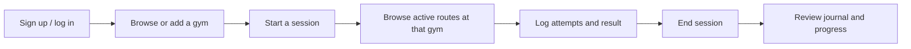
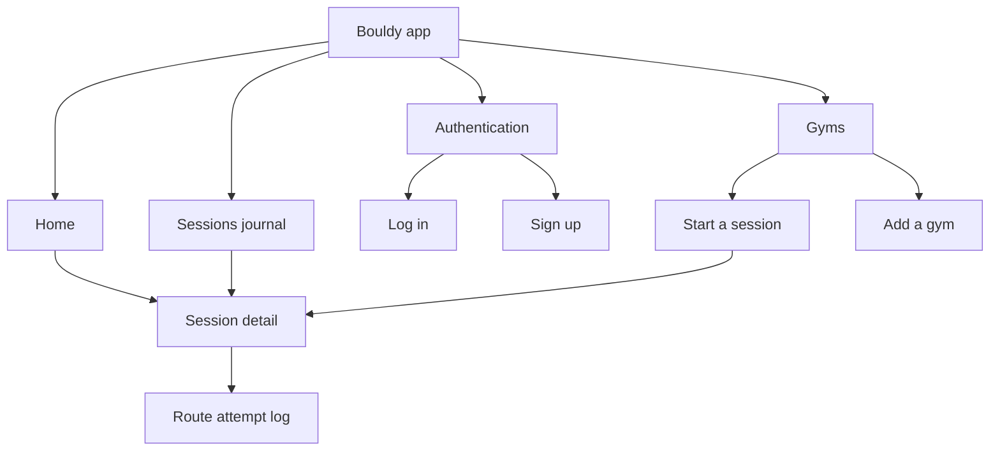
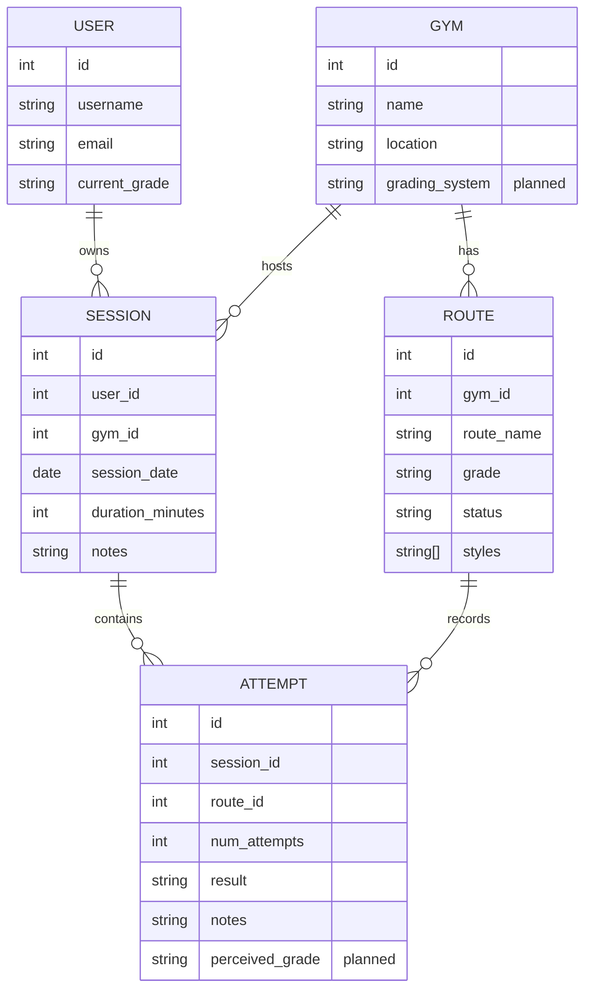
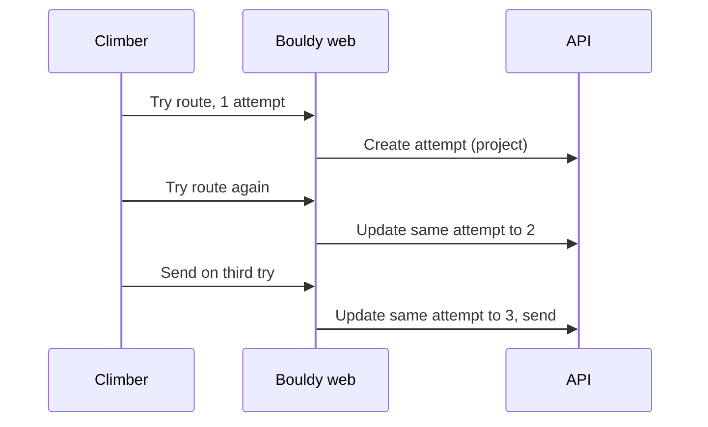

# Bouldy — Master Product & Engineering Specification

> **Living source of truth.** Update this document in the same change set as any user-visible flow, data contract, route, or architecture decision. If implementation and this specification disagree, fix one before merging.

**Product:** Bouldy
**Surface:** mobile-first web app, intentionally presented as a focused phone-sized experience on desktop
**Frontend repository:** `AmeerulH/bouldy`
**Backend service:** `https://bouldy-api.onrender.com`
**Last updated:** 2026-09-13

## 1. Product in one minute

Bouldy is a bouldering-session tracker for climbers. A climber chooses a gym, starts a session, records progress on routes, and looks back on their climbing history.

The product is built around a practical bouldering constraint: routes are temporary. A gym resets walls often, but Bouldy must preserve a climber's historical attempts. Routes are therefore **retired**, never removed from history.

### Core journey

### Product principles

- **Mobile first, always.** The desktop browser keeps the same phone-oriented experience rather than becoming a separate dashboard. At wider widths, it remains a full-height, square-edged mobile canvas rather than a floating rounded card.
- **Fast while standing below a wall.** The important action should take a few obvious taps, have a clear outcome, and never require reading a dense screen.
- **History is durable.** Retired routes remain attached to past sessions and attempts.
- **A gym's language comes first.** Grades are initially stored as the gym displays them. The gym's grading-system label is free text, because local gyms use different systems.
- **Progress, not performative metrics.** Home summaries use real session and attempt data. No invented check-ins, badges, or totals.

## 2. Scope and roadmap

### Working now

- Account registration, login, logout, and current-user profile.
- Gym list and session start from an existing gym.
- User-owned session creation and history.
- Route browsing and logging attempts against a route.
- Attempt count and outcome: `project`, `zone`, `send`, or `flash`.
- Flash recognition: a route completed in one attempt is displayed with `⚡`.
- Route lifecycle support in the API: active versus retired routes.

### This product slice (being implemented)

- A dedicated **Gyms** screen with a clear add-gym flow.
- A dedicated **Sessions** journal screen at `/sessions`, replacing the generic “History” mental model. `/history` redirects there for compatibility.
- A data-backed **Home** summary: recent session, gyms visited, sends, flashes, and useful next actions.
- A clean session-start flow that lets a climber choose an existing gym or add one without losing their place.
- Route logging that makes route styles and attempt outcomes easy to record and scan.
- The app-wide three-tab navigation: Home, Sessions, Gyms.

### Planned backend contract — do not fake persistence

These are intended features, but the current frontend must label them as unavailable or local-only until the API contract lands.

| Feature | Needed durable data | Proposed owner | Status |
| --- | --- | --- | --- |
| Gym grading system | `Gym.grading_system: string` | Backend migration + gym schema | Planned; free text |
| Perceived difficulty | `RouteAttempt.perceived_grade: string` or an explicitly session-scoped route-log field | Product/Backend decision required | Planned |
| Route photo | media asset + `Route.photo_url` | Storage + backend | Future |
| Beta video | media asset + `Route.beta_video_url` / separate beta model | Storage + backend | Future |
| Grade conversion | gym-grade-to-reference-grade mapping | Product + backend | Future |

**Important modelling decision pending:** the “felt like” grade belongs to the climber's experience of a route, so it should generally be attached to an attempt/session route log rather than the shared gym route. A final backend proposal must confirm this before implementation.

## 3. Information architecture

### Navigation

| Destination | Purpose | Primary action |
| --- | --- | --- |
| Home (`/`) | A useful snapshot of actual climbing activity and a direct route into the next session. | Start a session |
| Sessions (`/history`, to be renamed visually to “Sessions”) | Diary/journal of all owned sessions, ordered newest first. | Open a session |
| Gyms (`/gyms`) | Discover gyms, select one for a session, or add a missing gym. | Start a session / Add gym |
| Session detail (`/sessions/[id]`) | Record and review the routes attempted in one climbing visit. | Log route / End session |

The authenticated app uses a fixed bottom navigation for **Home**, **Sessions**, and **Gyms**. Account settings/logout remain in a compact header or future profile screen, not a fourth primary tab.

## 4. Screen specifications

### Home

**Job:** answer “what have I climbed recently, and what should I do next?”

**Contents, in priority order:**

1. Personal greeting and compact account menu.
2. Start-session CTA.
3. Recent session card with gym, date, duration, and route outcomes when available.
4. Period summary based only on fetched data: session count, gyms visited, sends, flashes.
5. A short recent-activity list or empty state pointing to Gyms.

**States:** loading skeleton; first-session empty state; partial data when a gym record is unavailable; API error with retry.

### Gyms

**Job:** make choosing a climbing venue simple and allow a user to add a missing venue.

**Contents:**

- Search/filter when the list becomes large.
- Gym name, location, and (once supported) free-text grading-system label.
- One clear “Start session” action per gym.
- “Add a gym” as an inline screen/flow rather than a disruptive modal.

**Add gym fields:**

- Name — required.
- Location — required.
- Grading system — free text; planned until the backend accepts it. Example: `Circuit colours`, `V-scale`, or `Gym-set scale`.

**States:** no gyms; add-gym validation; submit loading within button; created confirmation; duplicate/API error.

### Sessions journal

**Job:** be a climber's readable diary, not a spreadsheet.

**Contents:**

- A featured latest-session board with date, gym, duration/live status, route count, and an outcome strip for flashes, sends, in-progress routes, and routes not yet logged.
- Data-backed route cards for the latest session's gym. Each card uses a local colour-matched vector hold while route photos are unavailable, then shows the real grade, route name, style tags, attempt count, and result state.
- A direct Log route action opens the active session's route form; a completed session routes the climber to start another session.
- A compact journal below the board keeps all sessions ordered newest first, with gym, date, duration/status, and outcome summary.

**States:** no sessions; loading skeleton; missing gym fallback; API error with retry.

### Start session

**Job:** create a session without friction.

**Flow:**

1. Open Gyms.
2. Select an existing gym, or add a missing gym.
3. Create a new session for the authenticated user at that gym.
4. Go directly to that session's route log.

The backend derives session ownership from the JWT. The client must never rely on its visible `user_id` form field as authorization.

### Session detail and route logging

**Job:** record performance on routes at the chosen gym while climbing.

**Contents:**

- Session header: gym, date, editable note, elapsed/final duration, end-session action.
- Active routes belonging to the session's gym; retired routes remain visible only in historic context.
- Route metadata: gym grade, colour, wall, setter, and style tags when supplied.
- Route styles can include technical styles and wall angles, such as `Slab`, `Vertical`, `Overhang`, `Roof`, `Crimps`, `Slopers`, `Dyno`, `Static`, and `Balance`.
- Attempt counter with clear increment/decrement or explicit count update.
- Result control: project, zone, send, flash.
- A flash displays `⚡ Flash` and should have exactly one recorded attempt.
- Notes per attempt.

**Future fields:** user-perceived grade, photos, and beta videos. These remain visibly planned but must not look actionable until a backend contract exists.

## 5. Data model and ownership

### Current backend entities

| Entity | Current fields used by the frontend | Ownership rule |
| --- | --- | --- |
| User | id, username, email, current grade | Authenticated profile only |
| Gym | id, name, location | Public catalogue; write permissions need tightening before public launch |
| Route | gym, name, grade, colour, wall, setter, set/retired dates, status, styles | Belongs to a gym; preserve retired records |
| Session | user, gym, date, duration, notes | Only the authenticated owner can read/change it |
| Attempt | session, route, number of attempts, result, notes | Must match both the session's owner and gym |

### Attempt aggregation rule

One route has one attempt record within a session. Repeated tries update its count/result rather than creating duplicate physical-try rows. A climber can correct that record afterwards, including reducing its count and restoring a one-attempt `flash`; corrections must never silently add another try.

## 6. Frontend architecture

### Technology

- Next.js 16 App Router, React 19, TypeScript.
- Tailwind CSS v4 with CSS custom-property tokens in `app/globals.css`.
- Server Actions for mutations and HTTP-only cookie session storage.
- `motion` for targeted interface motion.
- Kokonut UI patterns are selectively adapted into the local `components/kokonutui/` directory; they must be reconciled with Bouldy's component vocabulary rather than copied indiscriminately.

### Key locations

| Concern | Location |
| --- | --- |
| Global tokens and interaction states | `app/globals.css` |
| Canonical visual specification | `DESIGN.md` |
| Design-system metadata and previews | `.impeccable/design.json` |
| Reusable UI primitives | `components/ui/` |
| Phone-sized app shell | `components/app-shell.tsx` |
| Primary bottom navigation | `components/bottom-nav.tsx` |
| Auth pages | `app/(auth)/login`, `app/(auth)/signup` |
| Authenticated pages | `app/(app)/` |
| Backend client and types | `lib/api.ts` |
| Server Actions | `lib/actions.ts` |
| HTTP-only session cookie helpers | `lib/session.ts` |

### Frontend rules

- Server Components fetch page data by default. Use client components only for browser state or interaction that cannot be a Server Action.
- All network mutations show an in-control loading state; a click must feel acknowledged immediately.
- Internal navigation shows an immediate full-screen loading state, while slow server-rendered routes have dedicated `loading.tsx` fallbacks. Form mutations keep their feedback inside the pressed button.
- Loading design: `BouldyLoader` reuses local detailed hold SVGs in three indeterminate variants: ascent (full-screen), traverse (page status), and hold (compact/account status). Button spinners stay circular. No fake progress percentages or forced waiting times.
- `PageSkeleton` matches Home, Sessions journal, session detail, Gyms, login and signup. Each route has its own streaming fallback; History uses the Sessions fallback. Navigation displays the destination skeleton immediately and keeps the bottom navigation available. After eight seconds, loading states explain that data is still being fetched. Reduced-motion users see stationary holds. Skeleton geometry is decorative and hidden from assistive technology; status labels announce loading.
- Development-only `/loading-preview` displays all three motifs and expandable skeleton examples. It returns not-found in production. These assets need no backend changes or external animation service.
- Every interactive element has visible keyboard focus, touch-friendly targets, disabled/loading states, and a useful error message.
- Use genuine fetched values in summaries. Show a good empty state rather than a made-up metric.
- Do not add a desktop dashboard layout. At widths above 430px, preserve the focused mobile shell.
- Respect `prefers-reduced-motion`.

### Design system

- `DESIGN.md` is the normative visual specification for future pages and components. Its creative north star is “The Climber’s Logbook.” Update it and `.impeccable/design.json` whenever foundational tokens, typography, motion, or shared component contracts change.
- Restrained light product surface with a dark performance panel and a selectable accent colour.
- `Barlow Condensed` is reserved for high-emphasis display headings; `Geist` carries controls, labels, data, and body copy.
- Cards are purposeful information groups, not generic containers. Corners stay compact (12–16px) and button loading is local to the pressed button.
- Motion is purposeful: 150–250ms for pressed states, list updates, and state transitions. No choreographed page-load sequence.
- Shared visual behavior belongs in `components/ui/`. Page files retain data fetching, authorization, aggregation, and form composition; they must not duplicate button, field, feedback-message, or section-heading contracts.
- Storybook 10 uses the official `@storybook/nextjs-vite` framework with Docs and Accessibility addons. Run `npm run storybook` for the local library or `npm run build-storybook` for the static build. Current stories cover BrandWordmark, AuthHeading, RouteHold, RouteMark, buttons, submit buttons, fields, feedback messages, section headings, loaders, all page skeletons, and bottom navigation. Extract SessionSummary, SessionListItem, RouteCard, ResultBadge, ExpandableFormSection, EmptyState, and ErrorState before adding their stories.

## 7. Backend architecture and API contract

### Technology

- FastAPI, SQLAlchemy 2, Alembic.
- PostgreSQL on Neon; API deployed on Render.
- JWT bearer authentication with PyJWT and Argon2 password hashing.

### Current endpoint families

| Domain | Endpoints used or expected |
| --- | --- |
| Auth | `POST /auth/register`, `POST /auth/login`, `GET /auth/me` |
| Gyms | `GET /gyms/`, `POST /gyms/`, `GET/PUT/DELETE /gyms/{gym_id}` |
| Routes | `GET /routes/`, `POST /routes/`, route detail/update/delete, retire route, gym-scoped routes |
| Sessions | owned list/create/detail/update/delete under `/sessions/` |
| Attempts | create/list nested under `/sessions/{session_id}/attempts`, detail/update/delete under `/attempts/{attempt_id}` |

### Security and validation expectations

- Authenticate session and attempt operations with a bearer token.
- Resolve the actual user server-side from JWT `sub`; do not trust a body `user_id`.
- When logging an attempt, validate that the session belongs to the current user, the route exists, and the route belongs to the session's gym.
- Retiring a route changes availability, not historical integrity.
- Before public launch, require appropriate authenticated/admin permissions for gym and route writes.

### Required changes before future features are enabled

1. Add a free-text gym grading-system field via an Alembic migration, Pydantic schemas, CRUD, and gym create/update responses.
2. Agree whether perceived grade belongs on `Attempt` (recommended) or a separate session-route log; add it end-to-end with migration, schema, validation, and API documentation.
3. Select storage, ownership, moderation, file-size, and deletion rules before accepting route photos or beta videos.
4. Document all new OpenAPI contracts and update `lib/api.ts` in the frontend at the same time.

## 8. Acceptance criteria for the current product slice

A signed-in user can:

1. Open Home and understand their real recent climbing activity.
2. Browse all gyms and create one if it is missing.
3. Select a gym and start a session.
4. See the gym's active routes and their available style/grade metadata.
5. Log a route outcome and number of attempts, including a one-attempt flash.
6. End the session and find it in the Sessions journal.
7. Return to Home and see the new session reflected in the summary.

## 9. Quality checklist

- [ ] No console errors, hydration warnings, or broken links.
- [ ] All forms have loading, success, validation, and backend-error states.
- [ ] Every primary action is reachable by keyboard and usable on touch.
- [ ] Mobile 320–430px and desktop-contained views are inspected.
- [ ] Build, lint, and relevant data-flow smoke tests pass.
- [ ] No fake values in product summaries.
- [ ] API additions are implemented and documented before dependent UI is marked live.
- [ ] This specification is updated with the same change.

## 10. Change log

### Brand and motion update (17 September 2026)

- Bolt B (`public/brand/bolt-b.svg`) is the selected Bouldy app mark. It is now the lockup symbol, browser/app icon (`app/icon.svg`), Home and auth identity. Crux and Three Moves remain archived proposals for reference.
- Login and signup use the Bouldy lockup and detailed hold artwork; Home uses the same identity with a compact personal greeting and “Keep showing up” heading above real session data.
- The surrounding viewport uses the same background as the mobile canvas; gray desktop gutters are removed. The mobile layout remains constrained to 430px on wide screens.
- `/welcome` is the public landing experience for unauthenticated visits to `/`, with signup and login links. It never forces a timed delay. An authenticated visitor still opens their Home journal at `/`. Logout returns to `/welcome`; Login links back through “Meet Bouldy”.
- If a stale browser cookie reaches an app route but fails the server-side user/session check, that route also redirects to `/welcome`. Session-required Server Actions follow the same rule.
- The authenticated route-group layout validates the session with `/auth/me` before rendering Home, Sessions, session detail, History, Gyms, or development-only authenticated previews. The proxy provides the fast missing-cookie redirect; the layout is the authoritative stale/invalid-token guard. Protected page content and bottom navigation never render for an unauthorized visitor.
- Unknown URLs render a branded mobile 404 with a direct route back to `/`. The proxy only intercepts known protected sections, allowing genuine missing pages to reach this recovery screen. The `/` destination resolves to the journal for authenticated users and `/welcome` for unauthenticated users.
- Page navigation uses a 220ms directional slide. Horizontal swipes between Home, Sessions and Gyms require at least 90px and predominantly horizontal movement. Forms, controls, screen-edge gestures and session-detail pages do not initiate tab swipes. Bottom tabs remain the accessible alternative. Reduced-motion disables navigation motion and simplifies the welcome artwork entrance.
- Logo proposals are standalone vectors under `public/brand/proposals/`: `bolt-b.svg` (A), `crux.svg` (B), `three-moves.svg` (C). All remain proposals pending the user's selection; none replaces the app icon. Development-only `/brand-preview` displays each at multiple sizes with SVG downloads. Both design preview routes are accessible without login only in development and return not-found in production.

| Date | Decision |
| --- | --- |
| 2026-09-13 | Established this document as the required living master spec. |
| 2026-09-13 | Gym grading systems will be free-text initially; conversion/mapping is a later feature. |
| 2026-09-13 | Perceived grade is product-approved but needs a durable backend model before it is enabled. |
| 2026-09-13 | Photos and beta videos are future functionality pending media/storage design. |
| 2026-09-13 | Implemented the Direction B route-log visual system: expressive route-colour markers, native grades, styles, attempt counts, and flash recognition. |
| 2026-09-13 | Implemented functional gym creation and route creation flows against the existing API contract; grading-system, perceived-grade, photo, and beta-video fields remain clearly marked as backend-dependent. |
| 2026-09-13 | Rebuilt the Sessions tab as the expressive session board: real latest-session stats, colour-matched local SVG hold assets, route-state cards, a live Log route action, and a compact complete journal beneath. |
| 2026-09-13 | Replaced flat route markers with individually exported, detailed SVG hold assets across the full route-colour vocabulary; blue routes also support the triangle/arete hold variant. |
| 2026-09-17 | Replaced the floating rounded desktop shell with a full-height square-edged mobile canvas and added immediate navigation overlays, route loading fallbacks, and button-level retry feedback for slow API paths. |
| 2026-09-17 | Added three animated bouldering-hold loaders, six page-specific skeletons, destination-aware navigation feedback, slow-request messaging, reduced-motion support and a local loading-design preview. |
| 2026-09-19 | Established “The Climber’s Logbook” as the canonical design system in `DESIGN.md` and `.impeccable/design.json`; extracted shared button, field, feedback, and section-heading primitives as the foundation for future Storybook coverage. |
| 2026-09-19 | Installed Storybook 10 with the Next.js Vite framework, Docs and Accessibility addons; added initial stories for Bouldy’s reusable primitives, brand, climbing assets, navigation, loaders, and page skeletons. |
